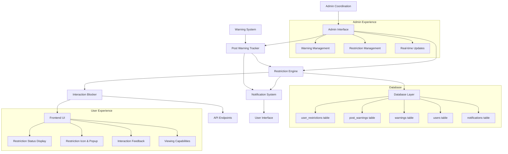

# Design Document: User Warning and Restriction System

## Overview

The User Warning and Restriction System extends the existing Flask application's warning mechanism to automatically restrict users who accumulate multiple warned posts. The system implements post-specific warning tracking, admin coordination features, and a progressive cooldown approach where restriction durations increase with each subsequent violation, while preserving users' ability to view content during restriction periods. The system ensures each post can only be warned once and coordinates between administrators to prevent duplicate warning actions.

### Key Design Principles

- **Post-Specific Warning Tracking**: Each post can only be warned once, preventing duplicate warnings
- **Admin Coordination**: Real-time coordination between administrators to prevent conflicts
- **Automatic Enforcement**: Restrictions are triggered automatically when users reach 5 warned posts
- **Progressive Escalation**: Each subsequent restriction increases in duration (1 day → 1 week → 2 weeks → 1 month → 3 months)
- **Selective Blocking**: Interaction capabilities are blocked while viewing capabilities are preserved
- **Administrative Control**: Admins can manually manage restrictions and override automatic decisions
- **Transparent Communication**: Users receive clear feedback about their restriction status and duration
- **Notification Integration**: Warnings are delivered through the notification system

## Architecture

### System Components



### Integration Points

The system integrates with existing Flask application components:

- **Warning System**: Extends the current `warnings` table and `admin_issue_warning()` endpoint with post-specific tracking
- **Post Warning Tracker**: New component that tracks warnings at the post level and prevents duplicates
- **User Authentication**: Leverages existing user session management and role-based access
- **Database Layer**: Uses the existing SQLite database with new `user_restrictions` and `post_warnings` tables
- **Admin Interface**: Extends current admin functionality with restriction management and real-time coordination
- **API Layer**: Adds new endpoints while modifying existing ones to check restriction status
- **Notification System**: Integrates with existing notification system for warning delivery

## Components and Interfaces

### 1. Post Warning Tracker

**Purpose**: Manages post-specific warning tracking and prevents duplicate warnings.

**Key Methods**:
```python
class PostWarningTracker:
    def is_post_warned(post_id: int) -> bool
    def warn_post(post_id: int, admin_id: int, user_id: int) -> dict
    def get_post_warning_info(post_id: int) -> dict
    def get_user_warned_post_count(user_id: int) -> int
    def remove_from_reported_queue(post_id: int) -> bool
    def get_warned_posts_by_user(user_id: int) -> list
```

**Business Logic**:
- Tracks warnings at the post level to prevent duplicates
- Integrates with notification system for warning delivery
- Manages reported post queue and admin coordination
- Counts warned posts for restriction threshold calculation

### 2. Restriction Engine

**Purpose**: Core logic for managing user restrictions and calculating cooldown periods.

**Key Methods**:
```python
class RestrictionEngine:
    def check_warning_threshold(user_id: int) -> bool
    def calculate_cooldown_period(user_id: int) -> int  # days
    def create_restriction(user_id: int, admin_id: int) -> dict
    def is_user_restricted(user_id: int) -> bool
    def get_restriction_details(user_id: int) -> dict
    def deactivate_expired_restrictions() -> int
```

**Business Logic**:
- Monitors warned post count per user (threshold: 5 warned posts)
- Calculates progressive cooldown periods based on restriction history
- Manages restriction lifecycle (creation, activation, expiration)
- Resets warned post count when restrictions are created

### 3. Interaction Blocker

**Purpose**: Middleware component that prevents restricted users from performing blocked actions.

**Key Methods**:
```python
class InteractionBlocker:
    def check_user_can_interact(user_id: int) -> tuple[bool, str]
    def validate_post_creation(user_id: int) -> tuple[bool, str]
    def validate_comment_creation(user_id: int) -> tuple[bool, str]
    def validate_reaction_creation(user_id: int) -> tuple[bool, str]
    def validate_content_editing(user_id: int) -> tuple[bool, str]
```

**Integration Points**:
- Decorates existing API endpoints for content creation/modification
- Returns appropriate HTTP status codes and error messages
- Allows viewing operations to proceed normally

### 4. Admin Coordination System

**Purpose**: Coordinates between administrators to prevent duplicate warning actions.

**Key Methods**:
```python
class AdminCoordination:
    def update_admin_interfaces(post_id: int, warning_info: dict) -> bool
    def disable_warning_buttons(post_id: int) -> bool
    def broadcast_warning_update(post_id: int, admin_id: int) -> bool
    def get_available_warning_actions(admin_id: int) -> list
```

**Integration Points**:
- Real-time updates to admin interface when warnings are issued
- WebSocket or polling-based coordination between admin sessions
- Visual feedback for available warning actions

### 5. Database Schema Extensions

**New Table: post_warnings**
```sql
CREATE TABLE post_warnings (
    id INTEGER PRIMARY KEY AUTOINCREMENT,
    post_id INTEGER NOT NULL,
    user_id INTEGER NOT NULL,
    admin_id INTEGER NOT NULL,
    warning_reason TEXT,
    created_at TEXT NOT NULL DEFAULT (datetime('now')),
    notification_sent INTEGER NOT NULL DEFAULT 0,
    FOREIGN KEY (post_id) REFERENCES posts(id) ON DELETE CASCADE,
    FOREIGN KEY (user_id) REFERENCES users(id) ON DELETE CASCADE,
    FOREIGN KEY (admin_id) REFERENCES users(id) ON DELETE CASCADE,
    UNIQUE(post_id) -- Ensures each post can only be warned once
);

CREATE INDEX idx_post_warnings_user ON post_warnings(user_id);
CREATE INDEX idx_post_warnings_post ON post_warnings(post_id);
CREATE INDEX idx_post_warnings_admin ON post_warnings(admin_id);
```

**New Table: user_restrictions**
```sql
CREATE TABLE user_restrictions (
    id INTEGER PRIMARY KEY AUTOINCREMENT,
    user_id INTEGER NOT NULL,
    restriction_start TEXT NOT NULL DEFAULT (datetime('now')),
    restriction_end TEXT NOT NULL,
    restriction_count INTEGER NOT NULL DEFAULT 1,
    is_active INTEGER NOT NULL DEFAULT 1,
    created_by_admin_id INTEGER NOT NULL,
    created_at TEXT NOT NULL DEFAULT (datetime('now')),
    deactivated_at TEXT NULL,
    FOREIGN KEY (user_id) REFERENCES users(id) ON DELETE CASCADE,
    FOREIGN KEY (created_by_admin_id) REFERENCES users(id) ON DELETE CASCADE
);

CREATE INDEX idx_user_restrictions_active ON user_restrictions(user_id, is_active);
CREATE INDEX idx_user_restrictions_end ON user_restrictions(restriction_end);
```

**Modified Existing Tables**:
- **posts table**: Add `is_warned` boolean column for quick lookup
- **reported_posts table**: Add `warning_status` column to track warning state
- **notifications table**: Extend to support warning notifications with post references

### 6. API Endpoints

**New Endpoints**:
```python
# Post Warning Management
POST /api/admin/warn-post/<post_id>        # Issue warning for specific post
GET /api/admin/post-warnings               # List all post warnings (admin)
GET /api/posts/<post_id>/warning-status    # Check if post is warned

# Restriction Management
GET /api/restrictions/status/<user_id>     # Check restriction status
GET /api/admin/restrictions                # List all restrictions (admin)
POST /api/admin/restrictions               # Create manual restriction (admin)
PUT /api/admin/restrictions/<restriction_id> # Modify restriction (admin)
DELETE /api/admin/restrictions/<restriction_id> # Remove restriction (admin)

# User Information
GET /api/user/restriction-status           # Get current user's restriction info
GET /api/user/warned-posts                 # Get user's warned posts

# Admin Coordination
GET /api/admin/available-warnings          # Get posts available for warning
POST /api/admin/warning-coordination       # Real-time warning updates
```

**Modified Endpoints**:
All content creation/modification endpoints will be enhanced with restriction checks:
- `POST /api/posts`
- `POST /api/comments`
- `PUT /api/posts/<post_id>`
- `PUT /api/comments/<comment_id>`
- `POST /api/reactions`
- `POST /api/submissions`

### 7. Frontend Integration

**Restriction Status Component**:
```javascript
class RestrictionStatusDisplay {
    showRestrictionBanner(restrictionData)
    showRestrictionIcon()
    showRestrictionPopup(restrictionData)
    updateInteractionButtons(isRestricted)
    displayCountdownTimer(endTime)
    showRestrictionModal(attemptedAction)
    formatRemainingTime(endTime) // "X day/s and Y hour/s"
}
```

**Admin Coordination Component**:
```javascript
class AdminCoordination {
    updateWarningButtons(postId, warningStatus)
    broadcastWarningUpdate(postId, adminId)
    refreshAvailableActions()
    showWarningAttribution(postId, adminInfo)
}
```

**UI Modifications**:
- Restriction icon beside hamburger menu (right side) for restricted users
- Restriction popup with formatted time display (no minutes/seconds)
- Restriction status banner for restricted users
- Disabled interaction buttons with explanatory tooltips
- Modal dialogs explaining restriction when users attempt blocked actions
- Real-time admin interface updates for warning coordination
- Visual indicators for warned posts in admin panel

## Data Models

### PostWarningRecord
```python
@dataclass
class PostWarningRecord:
    id: int
    post_id: int
    user_id: int
    admin_id: int
    warning_reason: str
    created_at: datetime
    notification_sent: bool
```

### RestrictionRecord
```python
@dataclass
class RestrictionRecord:
    id: int
    user_id: int
    restriction_start: datetime
    restriction_end: datetime
    restriction_count: int
    is_active: bool
    created_by_admin_id: int
    created_at: datetime
    deactivated_at: Optional[datetime] = None
```

### RestrictionStatus
```python
@dataclass
class RestrictionStatus:
    is_restricted: bool
    restriction_end: Optional[datetime] = None
    remaining_time: Optional[timedelta] = None
    restriction_count: int = 0
    warned_post_count: int = 0
    can_appeal: bool = False
```

### AdminCoordinationStatus
```python
@dataclass
class AdminCoordinationStatus:
    post_id: int
    is_warned: bool
    warned_by_admin_id: Optional[int] = None
    warning_timestamp: Optional[datetime] = None
    available_for_warning: bool = True
```

### ProgressiveCooldownConfig
```python
COOLDOWN_PERIODS = {
    1: 1,      # 1 day
    2: 7,      # 1 week
    3: 14,     # 2 weeks
    4: 30,     # 1 month
    5: 90      # 3 months (and all subsequent)
}
```

## Correctness Properties

*A property is a characteristic or behavior that should hold true across all valid executions of a system-essentially, a formal statement about what the system should do. Properties serve as the bridge between human-readable specifications and machine-verifiable correctness guarantees.*

### Property Reflection

After analyzing all acceptance criteria, several properties can be consolidated to eliminate redundancy:

**Consolidation Analysis:**
- Properties 2.1-2.4 (specific cooldown periods) are specific examples that will be covered by unit tests rather than properties
- Properties 3.1-3.5 (individual interaction blocking) can be combined into a comprehensive interaction blocking property
- Properties 4.1-4.5 (individual viewing capabilities) can be combined into a comprehensive viewing preservation property
- Properties 5.1-5.2 (status display components) can be combined with 5.3 into a comprehensive status information property
- Properties 8.1-8.2 (individual API endpoints) can be combined into a comprehensive API functionality property
- Properties 10.1-10.3 (individual feedback messages) can be combined into a comprehensive user feedback property
- Properties 11.3, 12.3, 14.2, 14.4 are redundant with other properties and will be consolidated
- New properties needed for post-specific warning tracking, admin coordination, and notification integration

### Property 1: Warning Threshold Triggers Restriction

*For any* user with exactly 5 warned posts, the Restriction_Engine SHALL automatically create an active restriction with appropriate cooldown period based on their restriction history.

**Validates: Requirements 1.1, 1.2, 1.3, 1.4, 1.5**

### Property 2: Progressive Cooldown Calculation

*For any* user with a restriction history, the calculated cooldown period SHALL follow the progressive schedule: 1st restriction = 1 day, 2nd = 7 days, 3rd = 14 days, 4th = 30 days, 5th+ = 90 days.

**Validates: Requirements 2.1, 2.2, 2.3, 2.4, 2.5**

### Property 3: Comprehensive Interaction Blocking

*For any* user with an active restriction, all interaction capabilities (content upload, commenting, reactions, editing, writer submissions) SHALL be blocked with appropriate error messages.

**Validates: Requirements 3.1, 3.2, 3.3, 3.4, 3.5, 3.6**

### Property 4: Viewing Capability Preservation

*For any* user with an active restriction, all viewing capabilities (posts, comments, profiles, public content, navigation) SHALL remain fully functional.

**Validates: Requirements 4.1, 4.2, 4.3, 4.4, 4.5**

### Property 5: Comprehensive Status Information

*For any* restricted user, the platform SHALL provide complete restriction status information including end time, remaining duration, restriction icon, and formatted popup display.

**Validates: Requirements 5.1, 5.2, 5.3, 13.1, 13.2, 13.3, 13.4, 13.5**

### Property 6: Automatic Restriction Lifecycle

*For any* restriction with an end time in the past, the system SHALL automatically deactivate the restriction and restore full user capabilities.

**Validates: Requirements 5.4, 5.5**

### Property 7: Warning Count Reset and Accumulation

*For any* user who receives a restriction, their warned post count SHALL be reset to 0, and subsequent warnings SHALL accumulate normally until the next threshold is reached.

**Validates: Requirements 6.1, 6.2, 6.3**

### Property 8: Historical Data Preservation

*For any* user with warnings and restrictions, the system SHALL maintain complete historical records of all warnings and restriction counts.

**Validates: Requirements 6.4, 6.5**

### Property 9: Administrative Override Capabilities

*For any* administrator, the system SHALL allow manual creation, modification, and removal of user restrictions with complete audit logging.

**Validates: Requirements 7.1, 7.2, 7.3, 7.4, 7.5**

### Property 10: Comprehensive API Functionality

*For any* valid API request, the system SHALL provide appropriate restriction status information, post warning management, and correct HTTP status codes.

**Validates: Requirements 8.1, 8.2, 8.3, 8.4, 8.5**

### Property 11: Database Schema Integrity

*For any* restriction or post warning record, the system SHALL maintain all required fields, referential integrity, and support efficient querying of active restrictions and warned posts.

**Validates: Requirements 9.1, 9.2, 9.4**

### Property 12: Comprehensive User Feedback

*For any* restricted user attempting blocked actions, the system SHALL provide clear, informative feedback including restriction status, end time, and reason.

**Validates: Requirements 10.1, 10.2, 10.3, 10.4**

### Property 13: Post-Specific Warning Tracking

*For any* post that receives a warning, the system SHALL permanently mark it as warned, prevent duplicate warnings, deliver notifications, and count it toward the user's restriction threshold.

**Validates: Requirements 11.1, 11.2, 11.5, 12.1, 12.2, 12.5**

### Property 14: Duplicate Warning Prevention

*For any* post that has been warned by any administrator, the system SHALL prevent all other administrators from issuing additional warnings for that same post.

**Validates: Requirements 11.3, 12.3**

### Property 15: Admin Interface Coordination

*For any* warning action taken by an administrator, the system SHALL immediately update all other administrator interfaces, disable warning buttons for warned posts, and provide clear visual feedback about available actions.

**Validates: Requirements 11.4, 12.4, 14.1, 14.2, 14.5**

### Property 16: Warning Attribution and Status Display

*For any* warned post, the system SHALL display the warning status, which administrator issued the warning, and remove it from the active reported posts queue for all administrators.

**Validates: Requirements 14.3, 14.4**

## Error Handling

### Database Error Scenarios

**Connection Failures**:
- Implement connection retry logic with exponential backoff
- Graceful degradation: allow viewing operations, block interactions
- Log all database connection issues for monitoring

**Constraint Violations**:
- Handle foreign key violations when users are deleted
- Prevent duplicate active restrictions for the same user
- Validate restriction end times are after start times

**Transaction Failures**:
- Implement proper rollback for failed restriction creation
- Ensure warning count resets are atomic with restriction creation
- Handle concurrent restriction operations safely

### API Error Responses

**Standard Error Format**:
```json
{
    "error": "User is currently restricted",
    "restriction_end": "2024-02-15T10:30:00Z",
    "remaining_time": "2 days, 5 hours",
    "can_appeal": true
}
```

**HTTP Status Codes**:
- `403 Forbidden`: User is restricted from performing action
- `404 Not Found`: Restriction or user not found
- `409 Conflict`: Attempting to create duplicate restriction
- `422 Unprocessable Entity`: Invalid restriction parameters
- `500 Internal Server Error`: System error during restriction processing

### Frontend Error Handling

**Network Failures**:
- Retry failed API calls with exponential backoff
- Show offline indicators when API is unreachable
- Cache restriction status for offline viewing

**User Experience**:
- Show loading states during restriction checks
- Provide clear error messages for failed operations
- Offer alternative actions when interactions are blocked

## Testing Strategy

### Dual Testing Approach

The system will use both unit tests and property-based tests for comprehensive coverage:

**Unit Tests** focus on:
- Specific cooldown period calculations (1 day, 7 days, 14 days, 30 days, 90 days)
- Database schema validation and constraints
- API endpoint response formats
- Admin interface functionality
- Error message formatting
- Edge cases like expired restrictions and concurrent operations

**Property-Based Tests** focus on:
- Universal restriction behaviors across all user states
- Comprehensive interaction blocking verification
- Warning threshold and accumulation logic
- Administrative override capabilities
- API consistency across different restriction scenarios

### Property Test Configuration

- **Minimum 100 iterations** per property test due to randomization
- Each property test references its design document property
- **Tag format**: `Feature: user-warning-restriction-system, Property {number}: {property_text}`

### Test Data Generation

**User Generation**:
- Users with varying warned post counts (0-10)
- Users with different restriction histories (0-5 previous restrictions)
- Admin and regular user roles
- Active and inactive user accounts

**Post Generation**:
- Posts with various warning states (not warned, warned by different admins)
- Posts in reported queue vs. warned posts
- Posts with different content types and categories
- Posts from restricted and unrestricted users

**Warning Generation**:
- Post warnings from different administrators
- Warnings with various reasons and timestamps
- Notification delivery status for warnings
- Duplicate warning prevention scenarios

**Restriction Generation**:
- Restrictions with various start/end times (past, present, future)
- Different restriction counts and cooldown periods
- Active and inactive restrictions
- Manual and automatic restriction creation

**Admin Coordination Scenarios**:
- Multiple administrators working simultaneously
- Real-time interface updates and coordination
- Warning button state management
- Available action synchronization

### Integration Testing

**Database Integration**:
- Test with realistic data volumes (1000+ users, 5000+ restrictions, 10000+ post warnings)
- Verify query performance for active restriction checks and post warning lookups
- Test concurrent restriction and warning operations
- Validate foreign key constraints and cascading deletes
- Test post warning uniqueness constraints

**API Integration**:
- End-to-end testing of restriction workflows
- Post warning workflow testing from report to notification
- Authentication integration with restriction checks
- Admin interface integration with restriction and warning management
- Frontend integration with restriction status display and admin coordination

**System Integration**:
- Integration with existing warning system and post-specific tracking
- Notification system integration for warning delivery
- Real-time admin coordination and interface updates
- Audit logging integration for admin actions
- Performance testing under load with multiple administrators

### Testing Tools and Framework

**Property-Based Testing**: Use `hypothesis` (Python) for generating test data and verifying properties
**Unit Testing**: Use `pytest` for structured unit tests
**API Testing**: Use `requests` library for endpoint testing
**Database Testing**: Use SQLite in-memory databases for fast test execution
**Integration Testing**: Use test database with realistic data volumes

### Continuous Integration

**Automated Testing**:
- Run all tests on every commit
- Property tests with 100+ iterations in CI
- Performance regression testing
- Database migration testing

**Test Coverage**:
- Minimum 90% code coverage for restriction-related code
- 100% coverage for critical paths (restriction creation, interaction blocking)
- Coverage reporting integrated with CI pipeline